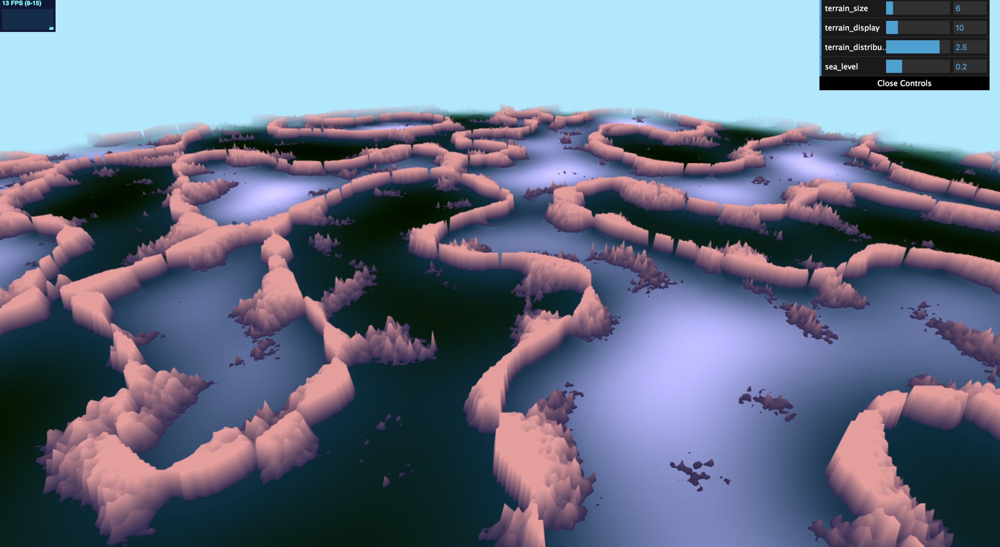
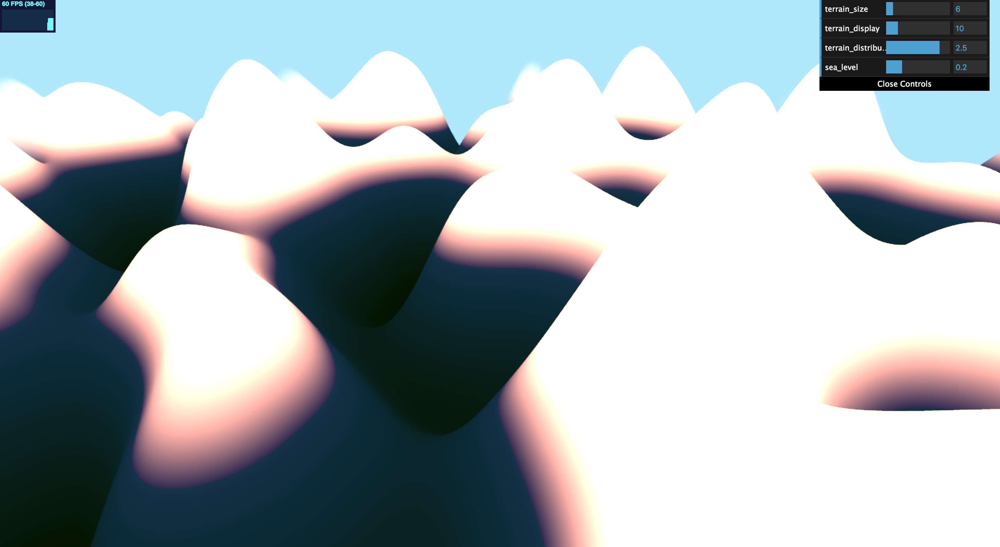
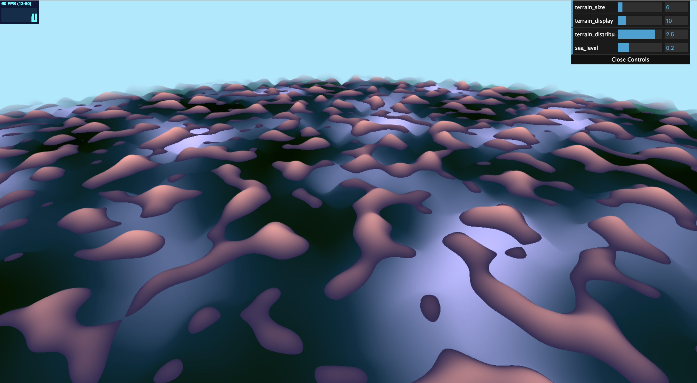
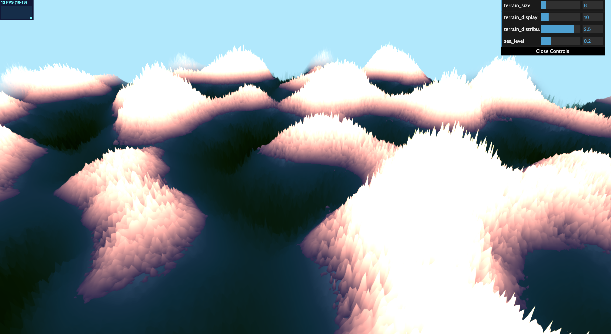
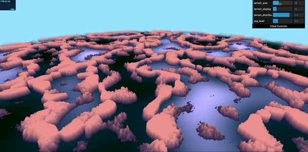
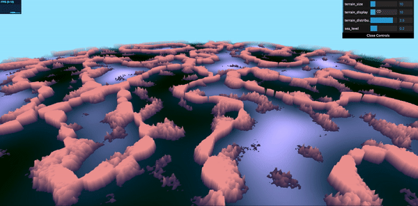
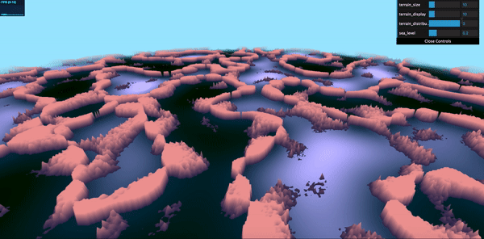
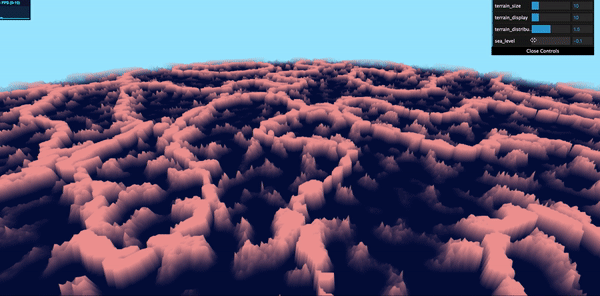

# CIS 566 Homework 1: Noisy Terrain

## Programmer Information
- Name: Chianti Yan
- PennKey: 85100574

## Citation and Reference
The code I used to generate the terrain includes external noise functions I found online:
- **Perlin Noise**

https://gist.github.com/patriciogonzalezvivo/670c22f3966e662d2f83
- **Worley Noise and FBM Noise**

https://github.com/Erkaman/glsl-worley 

- I also took a look at Red Blob Gems https://www.redblobgames.com/maps/terrain-from-noise/ when decided my variables for applying the noise function.

When you run the program, you should see this scene:

## Project Explained 
### Terrain Algorithms
My project simply relied on Perlin noise functions and Worley noise functions. 
Using Perlin noise functions, I generate two height maps, one for the road-like terrain and another for the scattered rocks. The road map is smoother such that it could generate flat surface whereas the rocks have steeper slopes which make them look more rock-ish. Originally when I came up with the functions, I was thinking about forest with high, tall trees, but it doesn't look well so I just changed the color map and make it kind of like a great wall (wonder Trump likes this style lol).

After I generated the height maps, I used a mix function with respect to a FBM noise coefficient to generate the first layer combination, and then use a smoothstep function on the existing map with the rock map with respect to the image y value. 

terrain map     |  rock map       |
:--------------:|:---------------:|
|    |

| mixing map once | mixing map twice 
|:---------------:|:--------------:
||

The nested mixing functions generated the basic terrain, and I modified the colors in fragment shader.

### Color Algorithms
The color map is pretty simple. If the sea level is higher than certain point, I considered it as part of the terrain. Otherwise, it's considered water. The terrain is simply a mix function about the y-axis, and the water is a mix function about the terrain height map. Since I generated the whole terrain based on my original terrain map, the water is kind of following the same distribution, such that pools are wrapped up by the walls, which looks pretty nice. 

The overlook of the terrain from the top looks like this:

## Live Demo
I added scroll bar on the right top of the website, so user could play around with different variables. 
**terrain_size** decides the proportion between water and terrain

**terrain_display** decides different terrain patterns 

**terrain_distribution** decides how the rocks are distributed and also how sharp they look like

**sea_level** decides the level of the water 

My entire project demo can also be found on github.io. Here is the link: https://chiantiyzy.github.io/hw01-noisy-terrain/
